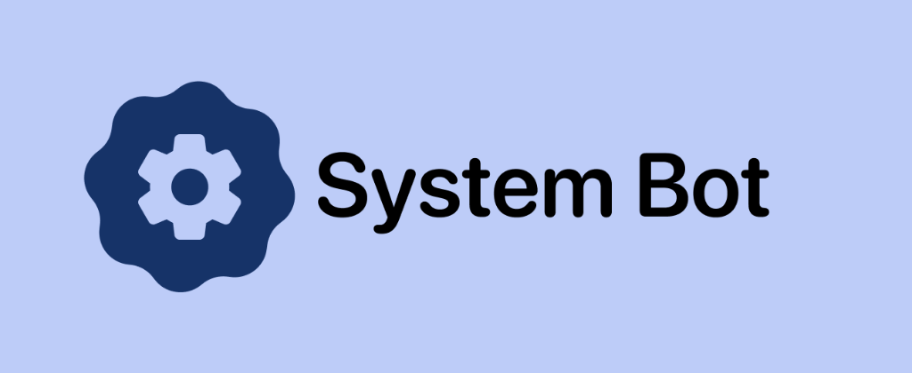

<div align="center">
  
  
  <h1>System Bot</h1>
  <p>All-in-one Discord server management, utility & moderation bot</p>

  <p>
    
    
    
    
  </p>

  <p><strong>Created & Maintained by tudustech</strong></p>
</div>

---

## ⚡ Features

### 🎛️ Management & Configuration
* **Interactive `/panel`**: In-Discord control panel with menus and buttons to configure all features.
* **Web Dashboard**: Local and hostable control center (`http://localhost:3000`) for server settings, channel pickers, and live stats.
* **1-Click Auto-Creation**: Automatically creates support ticket categories, voice channels, audit logs, and birthday calendars.

### 🛡️ Moderation & Security
* **Honeypot Anti-Raid**: Hidden trap channel that automatically bans, kicks, or times out raid bots that speak in it.
* **Audit Logging**: Logs message deletes, edits, bans, kicks, member joins/leaves, and voice moves into dedicated channels.
* **Purge Tool**: Clean 1–100 messages from any channel in one command (`/purge`).
* **Moderation Suite**: `/ban`, `/kick`, `/timeout`, and `/unban`.

### 🎮 Community & Engagement
* **Server Events (`/event`)**: Post gaming sessions or community events with custom schedules and RSVP buttons.
* **Giveaways (`/giveaway`)**: Host giveaways with automatic countdowns, entry tracking, and winner selection.
* **Polls (`/poll`)**: Interactive voting polls with live button reactions and vote counts.
* **Counting Game (`/counting`)**: Cooperative counting channel supporting **Easy** mode (streak protected) and **Hard** mode (resets to 0 on error).
* **Birthdays (`/birthday`)**: Automated birthday tracking with a live celebration calendar and celebratory roles.
* **AI Assistant (`/ai`)**: Integrated conversational AI assistant powered by Google Gemini.
* **Music Streaming (`/music`)**: Audio playback in voice channels with playback controls.
* **Temp Voice Channels**: Dynamic `➕│Join To Create` system that spawns private voice rooms on demand and deletes them when empty.
* **Welcome & Auto-Role**: Customizable welcome messages and automatic newcomer role assignment.

---

## 📋 Prerequisites

* **Node.js**: Version 18.0.0 or higher
* **Discord Bot Application**: Create one at the [Discord Developer Portal](https://discord.com/developers/applications)
  * Enable **Privileged Gateway Intents**: `Server Members Intent`, `Message Content Intent`, `Presence Intent`

---

## 🚀 Quick Installation & Setup

### 1. Clone the Repository
```bash
git clone https://github.com/Tudustech-hub/systembot.git
cd systembot

### 2. Install Dependencies
```bash
npm install
```

### 3. Configure Environment Variables
Copy the `.env.example` template to `.env`:
```bash
cp .env.example .env
```

Edit `.env` and enter your credentials:
```ini
# Discord Developer Portal -> Bot -> Token
DISCORD_TOKEN=your_discord_bot_token_here

# Discord Developer Portal -> General Information -> Application ID
CLIENT_ID=your_client_id_here

# Optional: Guild ID for instant local command registration (leave empty for global)
GUILD_ID=

# Gemini API Key for /ai chatbot (https://aistudio.google.com/app/apikey)
GEMINI_API_KEY=your_gemini_api_key_here
```

### 4. Deploy Slash Commands
Register all application commands with Discord:
```bash
npm run deploy
```

### 5. Start the Bot
#### Development / Foreground:
```bash
npm start
```

#### Production (PM2 Background Process):
```bash
npm run start:bg
```

---

## 🎛️ Web Dashboard

When the bot starts, the web dashboard automatically runs on port `3000`:
* Open `http://localhost:3000` in your browser.
* Switch between servers your bot is in.
* Manage module channels, launch giveaways, post polls, send embeds, and trigger 1-click auto-creations.

---

## 🔄 Updating the Bot

To pull the latest updates and hot-reload the bot without downtime:
```bash
npm run update
```

Or trigger an automatic update via HTTP endpoint:
```http
POST http://localhost:3000/api/git-pull
```

---

## 📁 Project Structure

```
├── data/                  # Local JSON state storage (auto-ignored in git)
├── scripts/
│   └── auto-update.sh     # Git pull & PM2 reload script
├── src/
│   ├── commands/          # Discord slash command definitions & handlers
│   ├── dashboard/         # Express server & web dashboard UI
│   │   ├── public/        # Frontend assets, HTML & icons
│   │   └── server.js      # Dashboard REST API
│   ├── db/                # JSON file database manager
│   ├── events/            # Discord.js client event listeners
│   ├── utils/             # Audit logger, stats counters, birthday schedulers
│   ├── config.js          # Environment config validator
│   ├── deploy-commands.js # Discord REST command deployment
│   └── index.js           # Bot startup & client initialization
├── .env.example           # Example environment template
├── .gitignore             # Secrets & data exclusion rules
├── ecosystem.config.js    # PM2 cluster configuration
└── package.json           # Project manifest
```

---

## 📄 License
This project is licensed under the MIT License.
